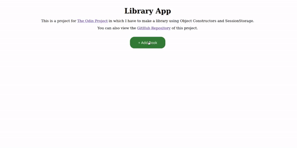

# Javascript Library

This is a project from The Odin Project's Javascript curriculum. This was my first project back at Javascript since spending so much time with Ruby and Ruby on Rails. It feels good to be able to manipulate the DOM again! The original project description can be found [HERE](https://www.theodinproject.com/lessons/javascript-library).

### Functionality
- Pressing the Add Book button makes an animated modal appear.
- This modal presents a form where the user can add the title, author, page count, and whether they have read the book or not.
- If the user clicks outside of the modal, clicks the close button, or if they submit a book, the modal will transition away.
- Upon submitting a book, Javascript dynamically builds a card for that book and inserts it into the DOM.
- The "Read" button lets you toggle if you've read the book or not.
- The "Remove" button will remove the book from your library.

### Video Demo

### Challenges While Learning

- The checkbox and read button
- Selecting the right DOM elements for read button and remove button
- 